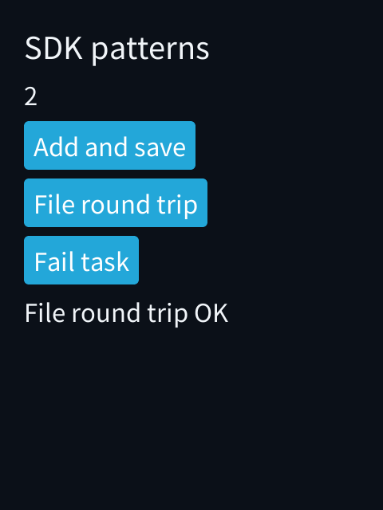
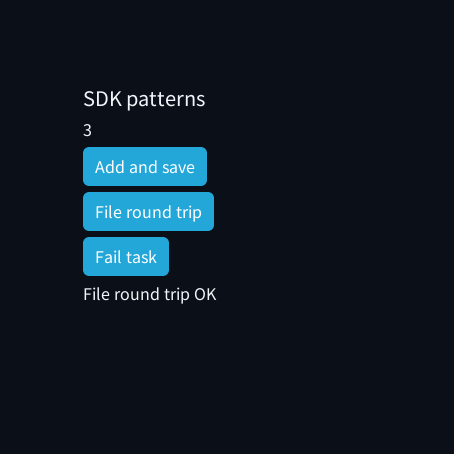

# C++ SDK 接口完善与模拟器验证（2026-10-10）

本轮在 `95dae86` 加当前已有工作区改动上继续审计，保留输入框、主题、控件、
诊断和模拟器手势等其他工作。已有 binary / FixedText / 标量 Storage / 国际化
不重做。下面区分已实现并验证的能力和仍需后续设计的能力，不称 SDK 已经完美。

## 已完成的改进

| 原因 | 修改及实际收益 | 内存变化 | 验证 |
| --- | --- | --- | --- |
| 文件、HTTP、PCM 的短传输需要每个应用重复管理偏移，容易丢失已完成字节或忙等 | 可选 `io.hpp` 的 ReadTransfer / WriteTransfer；一步至多一次 IO，显式 progress / complete / blocked / end | 借用调用方缓冲，不复制数据，不创建协程；游标 native 32 B、Wasm 16 B；未使用不预留内存 | 短读写、would_block、零字节写、提前 EOF、IO 失败后保留进度、超长返回、限额、移动、空输入、禁止堆分配；真实 AOT 每块最多 2 B 完成文件往返 |
| 自定义存档没有明确的类型化 schema 接口 | 可选 `codec.hpp`，显式版本 / 字段 / 最大编码容量；Storage 支持 `get_value<Codec>` / `set_value<Codec>` | 读取直接解码响应；编码直接写最终封包，没有第二份最大值缓冲；默认容量不扩大，应用加服务仍峰值 2 槽 | 7 B 黄金字节、版本、截断、多余字节、非法 bool、输入创建时拥有、取消和晚到结果、外部封包与重叠键；AOT 保存 1→重启读回→保存 2→3 |
| 自定义 codec 较大时不能靠扩大默认协程槽解决 | 增加显式外部 packet 的 `set_value<Codec>(key,value,packet)` | 服务只借用最终封包；不在协程中保留 Codec::max_bytes；输出对象自身仍须能装入应用的任务槽 | 精确外部容量、容量不足、键与封包重叠、有效字节；禁止堆分配 |
| close 丢弃提交失败，调用方无法知道是否接受，也无法重试 | Resource / File / NetBody / Asset / AudioSession / SensorSubscription 提供 `Result<void> close()`；失败保留拥有权，成功失效，再次关闭幂等 | 不新增成员或缓存，Resource native / Wasm 均保持 16 B | busy / inactive 失败后句柄不变、成功只关闭一次、移动、stop 后零 Host 调用；模拟器关闭后重新打开文件 |
| TaskScope 有错误回调，AppRuntime 却没有接到 App::on_error | 启动前接入 component / foreground 任务；仍可由应用显式覆盖 scope handler | 复用既有 2 个函数指针字段，Context / TaskScope 大小不变 | 立即失败、延迟失败、取消不报告、错误处理后继续操作、3 次启动、前后台、真实 AOT 错误 UI |
| State::update 能接收 T&，先修改内部值再比较相等会漏掉 dirty 更新 | 更新回调接收 const T&，返回新值；Ref 也使用同一约束 | 无新字段；已有按值回调仍可用；按 const 引用读取时不额外复制旧值 | 可变引用更新编译期拒绝、返回新值产生 dirty、相等值不刷新；既有 UI 和列表回归 |
| FS 的无效参数通过失败协程返回，仍占用帧池 | 使用 Task::failed 立即返回 | 无效请求 0 任务槽、0 Host 调用 | 无效路径和满池相关回归；合法异步路径不变 |
| NetBody 没有检查 Host 返回长度 | 超过调用方输出容量时返回 protocol_error | 无字段变化 | 长度错误、正常短读、关闭重试 |
| 安全区超过屏幕三分之一会被缩小，矩形圆屏还可能重复加边距 | safe_rectangle 完整尊重绝对安全边距，与圆形可用区域取交集；空区域返回 0；contains 避免 int 加法溢出 | 无字段或分配；scale_display 密度饱和防止整数回绕 | 非对称 / 空安全区、1..301 奇偶尺寸、矩形圆屏、整型边界、ASan/UBSan；圆屏 AOT 截图 |
| 产品模拟器字体固定 12..28 px，高 DPI 下间距缩放而文字偏小 | 按 density / font_scale 生成六个既有字体角色，不新增字体缓存 | 160 DPI 字号保持不变；字体对象仍为六个；高 DPI 的较大字形可能占用更多缓存，整机真实峰值尚未测 | 480×640 / 305 DPI 的 body 行高断言及前后截图；160 DPI 与国际化回归 |

`State::update([](int& n){ return ++n; })` 现在有意拒绝编译，应写
`State::update([](int n){ return n+1; })`。较大的模型可以用
`[](const Model& previous) -> Model` 构造新值。直接返回引用仍由 set 复制到拥有值。

## 有进度的 IO

```cpp
#include <pxa/io.hpp>

pxa::ReadTransfer transfer(buffer); // buffer / file 活到所有步骤完成
auto step = transfer.step(file, 1024);
if (!step) {
    // transfer.transferred() 保留先前进度；由业务决定放弃或重试。
} else if (step->state == pxa::TransferState::blocked) {
    // 等待下一事件或 co_await context.clock().yield()，不要忙等。
} else if (step->state == pxa::TransferState::end) {
    // 提前 EOF；completed_bytes() 只包含已经收到的内容。
}
```

complete 表示调用方所给 buffer 填满 / 写完，不能把它当成文件一定已到 EOF。
读返回 0 表示 EOF，写返回 0 表示没有进展；would_block 也是 blocked。
错误不重置进度，超过本次 span 的返回长度不推进游标。每次 max_bytes 必须大于 0；
空或已经完成的 transfer 不调用 IO。移动会使旧游标不再借用原缓冲。
`step_with` 可接入 PCM（`session.write_pcm`）等不同命名接口；PCM max_bytes 和
总容量需要按音频帧字节对齐。它不会悄悄做复制、转码、等待或无限重试。

## 自定义数据 codec

```cpp
#include <pxa/codec.hpp>

struct Preferences { std::uint32_t level; bool sound; };
struct PreferencesCodec {
    using value_type = Preferences;
    static constexpr std::size_t max_bytes = 7;
    static pxa::Result<void> encode(pxa::binary::Writer& out,
                                     const Preferences& value) {
        if (auto r=out.write(std::uint16_t{1}); !r) return r;
        if (auto r=out.write(value.level); !r) return r;
        return out.write(value.sound);
    }
    static pxa::Result<Preferences> decode(pxa::binary::Reader& in) {
        auto version=in.read<std::uint16_t>();
        if (!version) return std::unexpected(version.error());
        if (*version!=1) return std::unexpected(pxa::Error::unsupported);
        auto level=in.read<std::uint32_t>();
        if (!level) return std::unexpected(level.error());
        auto sound=in.read<bool>();
        if (!sound) return std::unexpected(sound.error());
        return Preferences{*level,*sound};
    }
};
// 在协程中：
auto saved = co_await ctx.storage().set_value<PreferencesCodec>("prefs", Preferences{3,true});
auto value = co_await ctx.storage().get_value<PreferencesCodec>("prefs");
```

max_bytes 为编码上限，实际封包只发送成功编码的字节。decode 包装器拒绝超过
上限或未消耗完的尾部；codec 自己负责版本、值范围和其他业务约束。输出必须
拥有内容，不能返回借用 Host 响应的 string_view / span。编码失败可能已经修改
调用方的缓冲，调用方应只在成功后使用结果。这里不隐式序列化原生结构布局。

Storage 协议上限仍为 2048 B；Host 可以配置更小限额。默认拥有封包的较大
codec 可能超过配置的 coroutine slot，返回 resource_limit；不要默认扩大池。
此时可使用显式复用的外部 packet，最大键 + 最大值共需 2140 B。
外部 packet 必须活到任务完成 / 取消，不能同时给另一未完成请求使用；源对象
不得与外部 packet 重叠，键会在编码前单独快照。较大解码结果本身仍需要应用
选择合适的帧容量，codec 也可以在类型内部使用按需动态存储。

## 关闭与错误回调

`close()` 成功表示 Core 接受关闭请求，不承诺数据落盘或介质 fsync。
提交拒绝时保留句柄，可在合法事件阶段重试；已经关闭返回成功。析构 / reset
仍是尽力释放并放弃 Guest 所有权，停止阶段不调用 Host，由 Host 回收组件资源。
显式处理关闭错误后，若希望保留资源供下一事件重试，必须同时让资源对象继续存活。

`on_error(Context&, Error)` 接收已开始的 scope 任务未处理错误，以及可恢复 UI
提交错误。`TaskScope::start` 的分配 / 容量失败仍由它的 Result 返回，必须检查；
被 co_await 后由父任务处理的错误不会重复报告。App 错误钩子必须不抛异常，
不要在钩子中重新启动必然立即失败的同一任务形成递归循环。

## 实际验证及成本边界

修改前 SDK 工作区复制到独立目录后完整回归通过；修改后完整原生 SDK 回归通过。
新增 IO / codec / lifecycle-state / geometry 通过 ASan + UBSan；IO / codec 同时
禁止 Guest C++ new。CLDR 48 的 3767 普通 cardinal / ordinal 样本及既有 UI、
资源、IPC、Surface 和游戏命令回归也通过。新示例见
[sdk-patterns](examples/sdk-patterns/main.cpp)。

真实 WAMR AOT 模拟器验证三轮共用存档：计数 0→1→重启读 1→2→重启读 2→3；
每轮文件最多 2 B 一次传输，关闭并重新打开严格解码；未找到文件使 scope
调用应用 on_error，按钮仍能继续执行文件操作。前后台及重复启动通过。
模拟器使用真实 LVGL 按钮回调、响应队列、POSIX 文件和 KV，非 native Guest mock；
截图确认实际文本，检查了 240×320 / 160 DPI、480×640 / 305 DPI、454×454 圆形。
这不是输入延迟或 FPS 性能测试。

实际应用内容截图（不包含系统栏和 Host 外形遮罩）：





机器可读的布局、构建、Counter 对照及内存声明数据放在示例的
`validation/` 目录，与截图一起进入独立 SDK 包。

同一 O3 工具链、同一 Counter 源码，仅 SDK 前后变化：

| 指标 | 修改前 | 修改后 |
| --- | ---: | ---: |
| Counter Wasm 文件 | 55592 B | 55592 B，SHA256 完全一致 |
| Counter x86_64 AOT 文件 | 86440 B | 86440 B，SHA256 完全一致 |
| Native Context | 1736 B | 1736 B |
| Native TaskScope | 208 B | 208 B |
| Native State<int> | 16 B | 16 B |
| 默认任务池预留 | 8208 B | 8208 B |

独立 SDK 导出不带 C SDK，在仓库外构建 sdk-patterns 的 Wasm / x86_64 / Xtensa
S3 / RISC-V S31 AOT，三份 Wasm 哈希相同，并运行独立导出包生成的 x86 AOT。
示例 Wasm 初始线性内存为 2 页（131072 B）、声明上限为 1 MiB；这是声明容量，
不代表实际驻留峰值。S3 / S31 本轮仅交叉构建，未刷设备或声称真机验证。
WASI 工具链显式复用本地锁定 SDK 34，其余头文件、实现、生成器和工具来自导出包。

复现：

```sh
bash deps/pxa-system/tools/package/test_guest_cpp.sh
cmake -S deps/pxa-system/simulator/desktop -B local/sdk-polish-simulator \
  -DCMAKE_BUILD_TYPE=Release -DPXSYS_BUILD_TESTS=ON \
  -DPXSYS_LVGL_SOURCE_DIR="$PWD/firmware/managed_components/lvgl__lvgl"
cmake --build local/sdk-polish-simulator \
  --target pxsys_sdk_patterns_test pxsys_i18n_app_test pxsys_desktop_simulator -j 8
ctest --test-dir local/sdk-polish-simulator \
  -R '^pxsys_sdk_patterns_test$|^pxsys_i18n_app_test$|^pxsys_desktop_simulator_(smoke|self_test)$' \
  --output-on-failure
```

本地详细日志和前后快照在项目 `local/sdk-polish-20261010/`。原生布局和相同
Counter 产物证明本轮没有扩大它们的默认成本，不能替代所有应用的堆 / 栈
峰值或设备 SRAM / PSRAM 测量。较大 codec 的拥有封包创建时栈暂存仍存在；
本轮未引入新的全局 scratch 来掩盖成本。高 DPI 字形缓存峰值也未量化。

## 剩余设计缺口

- SurfaceFrame 未 present 就销毁仍会关闭 Surface，独立 discard 必须同步设计
  Host 安全归还协议，不能仅在 Guest 标记可复用。
- 大拥有封包的创建时暂存和精确协程帧 / 本次栈峰值统计仍需后续优化验证。
- 通知覆盖和按作用域的类型化订阅还有空间；不应默认给 Context 增加订阅表。
- UI / Navigation 的页面保留策略、通用可变字号和极小屏幕布局降级仍需完善。
- 自定义 codec 的迁移、校验和、复杂容器和事务业务是显式策略；本轮没有
  假设任何对象都可以自动安全序列化。

这些缺口没有阻止本轮新增接口的模拟器验收，也未被标记成已完成。
