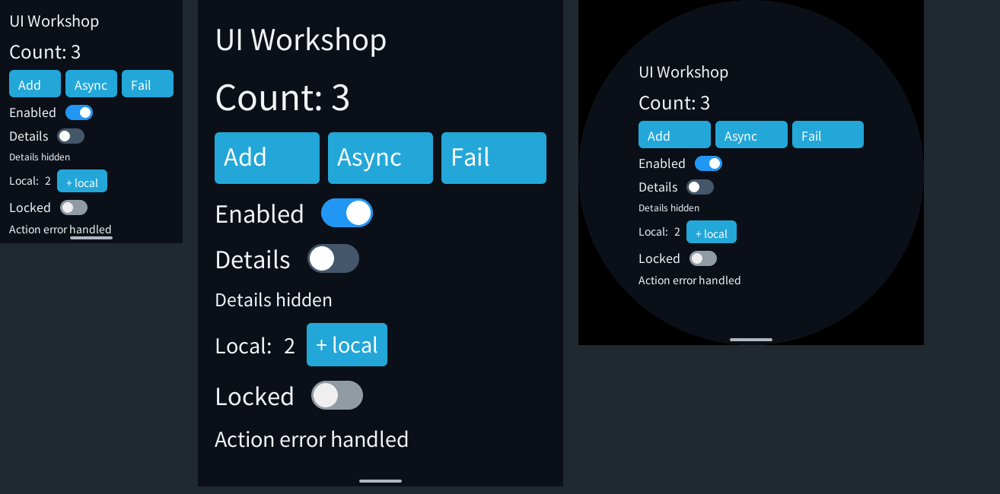

# C++26 SDK/UI 修复与验证（2026-10-11）

本轮修复 10 月 11 日审查中已复现的 SDK/UI 问题，并继续检查接口组合、所有权、
失败恢复和默认开销。基线是开始修复前的工作区快照，包含此前未提交的功能；
没有用旧 HEAD 替代。完整快照、包、BGRA 和日志在工作区
`local/ui-repair-20261011/`，本目录的 `repair-20261011/` 保留可审查证据与复现工具。
原审查的只读报告与修改前日志保留在 `local/cpp-ui-audit-20261011/`。

## 改动、原因及证据

| 原因 | 最终行为与收益 | 内存变化 | 验证 |
|---|---|---|---|
| Toggle.enabled 写到外层 Row，实际开关仍可触摸 | 交互修饰定位开关，文字修饰定位 Label；Component/修饰链保留节点元数据 | 无新增视图字段或 Host 节点 | 原生节点编码；五配置实际 AOT 中的 LVGL 指针按下/抬起，不再选中 |
| 禁用容器不能阻止原生后代输入 | Host 区分自身禁用和继承禁用；重新启用保留子节点设置；MOVE 与失败事务恢复一致 | 自身标志使用原有尾部填充，编译期断言禁止扩大节点；复用 undo flags，无新树缓存 | 真实指针零事件、文字输入焦点拒绝、重新启用、MOVE、alpha 准备失败回滚及 resident bytes 不变 |
| 早先的 State 修饰可在更新时覆盖最终属性 | 类型变换移除被覆盖的来源；跨不同修饰与 Component 仍以最终值为准 | 去掉旧值和旧绑定；特定 Page 256 → 176 B | 旧 State 不再标脏/提交，最后一个 State 仍更新；容量推导断言、ASan/UBSan |
| SafeArea 更新强制显示原本隐藏的应用内容 | 应用可见性与可用内容区共同决定显示；算入额外四侧边距，耗尽后隐藏、恢复后遵守应用状态 | 默认 SafeArea 大小不变；两个来源合用一个输出绑定，额外订阅只按需保存 | 隐藏状态、指标更新、边距耗尽/恢复、PATCH 失败重试、Component 内封装、销毁后更新 State |
| 初次挂载失败留下缓存模型/片段，重试返回 bad_state | 清理未激活绑定、Ref 和候选视图；保留稳定 Component 模型与已消费的移动专用参数 | 无新增 Page 字段/候选槽，不增加原有活动树/候选树数量 | 连续两次失败后 mount 成功；部分编码失败；Scroll/Component/When/List/Refresh、Ref、构造/析构次数 |
| List/Refresh 缺少共同修饰，四侧 Padding 被容器重载挡住 | 共用修饰器；Row/Column/SafeArea 支持 Padding 四侧；非复制视图用临时值或 std::move | 空基类不增加 List/Refresh，修饰不增加 Host 包装节点 | 编译能力检查、真实 padding 字节、行池及挂载回归 |
| 无效工厂/非复制视图常在模板深处报错，Dp 大字面量可能截断 | ViewFactory/ListFactories、构造约束和 consteval 字面量在接口处拒绝错误 | 编译期处理，无运行时状态 | 8 项诊断测试，覆盖无效返回值、lvalue、整数溢出、有效组合与环境选择 |
| 启动配置/通知需要每个应用重复接到 State | 可选 Environment 只保存选中的显示、主题、能力；完整校验后更新，错误保留已有状态 | 默认显示版本 64 B，等于原 State；三项 152 B；不扩大 Context | 启动与通知错误、非目标事件、选项约束、零堆分配；真实 AOT 示例 |
| 相同屏幕指标仍触发绑定 PATCH | DisplayMetrics/UiCapabilities/UiAppearance 值比较抑制相同 State 更新 | 不增加字段或缓存 | 连续 100 次相同通知：零标脏、零 UI 导入；变化一次后正常更新 |

Host 继承状态仅在 enabled 或 MOVE 事务中重算，不在普通文字 PATCH 或每帧扫描。
当前实现遍历受管节点并检查祖先；极深/大量节点的 enable 切换成本尚未单独基准化，
这不应被当作减少普通渲染时间的证据。内存断言在本轮原生 Host 编译通过，
三目标 SDK AOT 构建不等于 ESP32 Host 固件已交叉编译。

采用当前锁定的 C++26 模式，使用显式对象参数、concepts、编译期类型变换、
consteval 校验及空成员消除；没有为使用新语法而替换现有有界池或增加容器。
也检查了事件解码、Task/Context、IO/Codec、资源与国际化接口，沿用已有所有权/
取消/容量实现，并由全量回归覆盖。本轮没有新的证据证明它们需要另一套运行时。

## 相同负载：默认开销与内存

对象探针在 Linux x86-64、Clang 23、C++26 下运行。
[原始数据与探针](repair-20261011/footprints.json) 中普通所选类型均不增长：

| 对象 | 修改前 | 修改后 |
|---|---:|---:|
| counter Page / State<int> | 328 / 16 B | 328 / 16 B |
| Context / TaskScope / 协程池及元数据 | 1,736 / 208 / 8,208 B | 1,736 / 208 / 8,208 B |
| SafeArea：绑定指标 / 静态指标 | 40 / 88 B | 40 / 88 B |
| Component：可移动模型 / 原地构造 State 模型 | 40 / 104 B | 40 / 104 B |
| When / KeyedList<4> / Refresh | 288 / 1,152 / 264 B | 288 / 1,152 / 264 B |
| `.enabled(state).radius(...).enabled(false)` 视图 / Page | 80 / 256 B | 64 / 176 B |

基础 counter 的源码、参数及负载相同；两份 SDK 都独立导出、构建、签名。
Wasm 均 55,594 B，Linux AOT 均 86,424 B，前后 SHA-256 **完全相同**，
初始线性内存 2 页，DATA/代码及初始化布局没有变化。
参见 [产物信息](repair-20261011/counter-comparison.json)。

每侧三轮启动全新 engine，每轮完成 100 次 UI 更新后采样；峰值从本次 engine
初始化起计，包含首次初始化，不是历史累计峰值。
[六轮结果](repair-20261011/counter-memory.json) 全部一致：

| 实际 AOT counter | 修改前 | 修改后 |
|---|---:|---:|
| WAMR allocator 稳定 / 本次峰值 | 31,393 / 48,193 B | 31,393 / 48,193 B |
| Guest 线性内存稳定 / 本次峰值 | 131,072 / 131,072 B | 131,072 / 131,072 B |
| 保留 artifact buffer | 0 B | 0 B |
| Guest 事件缓冲（已含在线性内存中） | 128 B | 128 B |

这些类别可能重叠，不能相加当作物理 RAM。WAMR allocator 不统计所有 mmap
代码、LVGL/字体、显示缓冲或 Host 堆；相同 AOT 的代码布局保持不变，不等于测得
完整进程代码映射占用。原生 UI 三组生命周期测试统计 Guest operator new 均为零；
应用显式返回长字符串/动态容器及 Host 原生控件分配不在零分配承诺中。
ESP32 SRAM/PSRAM 和 Guest 辅助栈实际使用峰值未在本轮测量。

## 编码微测

相同 counter 预热 10,000 次，7 组各 100,000 次更新与 flush；前后交替八轮。
Host 桩读取全部编码字节；编译与其他本轮基准任务结束后才测量。

| 指标 | 修改前 | 修改后 |
|---|---:|---:|
| 每轮总导入 / 提交字节校验 | 2,130,003 / 972,901,129 | 2,130,003 / 972,901,129 |
| 空闲 flush 导入 | 0 | 0 |
| 轮次中位数之中位数 | 96.583 ns | 94.677 ns |
| 各轮中位数范围 | 91.771–108.535 ns | 89.669–105.774 ns |

差约 2%，落在轮次波动内，且基础产物完全相同，**不据此宣称性能提升**。
收益的确定证据是消除无效状态更新/导入、旧绑定及错误重建。
此前编译繁忙期间的粗测保留在 local，不作为报告比较数据。
这是原生 Guest 编码微测，不含 Wasm/AOT 执行、Host 光栅化、排队和显示 FPS。
[完整样本](repair-20261011/microbench.json) 可用上一轮的 compare_sdk.py 重现。

## 实际模拟器与独立 SDK

运行签名 C++ AOT，经实际产品 Host、LVGL 控件和生命周期派发。
除已有条件切换、局部状态、动作错误、异步完成、前后台及滚动验证，新增 Locked
开关使用真实 LVGL 指针读取检查。其他按钮/开关的自动化仍使用原生事件派发，
不能把全部自动化操作称为物理鼠标或真机触摸。

| 配置 | body 行高 | 标题坐标 | 截图 |
|---|---:|---:|---|
| 240×320，160 DPI | 23 px | 12,12 | [profile-0](repair-20261011/profile-0.png) |
| 480×640，305 DPI | 45 px | 22,22 | [profile-1](repair-20261011/profile-1.png) |
| 454×454 圆屏 | 23 px | 79,79 | [profile-2](repair-20261011/profile-2.png) |
| 320×240，圆角 24，T18/R8/B12/L32 安全区 | 23 px | 44,30 | [profile-3](repair-20261011/profile-3.png) |
| 200×200，小屏滚动 | 23 px | 12,12 | [profile-4](repair-20261011/profile-4.png) |

截图读实际刷新后的显示缓冲，保留系统形状遮罩；已人工检查文字、开关及安全区。
小屏截图是页面顶部，底部控件通过滚动访问。组合预览如下：



完整示例明确新增一个 Locked 控件并采用 Environment，与旧示例负载不同，不能
当作默认 SDK 的前后内存比较。每个配置独立启动 engine，稳定 WAMR 占用 153,753 B，
本次初始化至交互峰值 170,839 B，Guest 线性内存稳定/峰值均 196,608 B；
artifact buffer 0、event buffer 128 B。[逐配置数据](repair-20261011/profiles.json)。
这组数据也不覆盖全部 Host/显示内存。

新导出的独立开发包与当前源码头文件逐项哈希一致，未使用 C SDK。三个目标均
以 C++26/O3 构建，三个 Wasm 的 SHA-256 一致；实际模拟器运行导出包生成的 AOT：

| 目标 | Wasm | AOT | 初始 / 最大线性内存页数 |
|---|---:|---:|---:|
| Linux x86-64 | 508,931 B | 320,068 B | 3 / 16 |
| ESP32-S3 | 508,931 B | 509,680 B | 3 / 16 |
| ESP32-S31 | 508,931 B | 512,840 B | 3 / 16 |

见 [构建数据](repair-20261011/builds.json) 与 [头文件哈希](repair-20261011/source-hashes.json)。
新增示例功能与修复所需的代码有体积成本，未使用它们的 counter 没有这些成本。
本轮设备目标仅为交叉构建，不宣称真机触摸、帧率或整机峰值已验收。

## 验证与复现

原生 SDK 全量（含 UI/任务/服务/资源/国际化及编译诊断）、三组 UI ASan/UBSan、
LVGL adapter、模拟器 smoke/self-test、i18n、SDK patterns 均通过。
主工作区与导出包各运行五种显示配置。完整日志位于本报告的 repair-20261011 目录。

```sh
# pxa-system 根目录
bash tools/package/test_guest_cpp.sh
python3 sdk/guest-cpp/tests/test_ui_diagnostics.py
for name in ui_declarative ui_lifecycle ui_environment; do
  clang++ -std=c++2c -O1 -g -fno-exceptions -fno-rtti -Wno-attributes \
    -Wall -Wextra -Werror -fsanitize=address,undefined -fno-omit-frame-pointer \
    -I sdk/guest-cpp/include sdk/guest-cpp/tests/${name}_test.cpp \
    sdk/guest-cpp/src/runtime.cpp -o /tmp/pxa-${name}
  ASAN_OPTIONS=detect_leaks=1 /tmp/pxa-${name}
done

# 模拟器配置/构建步骤同 REPORT.zh-CN.md
PXA_SDK_TEST_ARTIFACT_DIR=/tmp/ui-repair-captures \
ctest --test-dir /path/to/simulator --output-on-failure \
  -R 'pxsys_(declarative_ui|i18n_app|sdk_patterns)_test|pxsys_desktop_simulator_(smoke|self_test)|pxa_lvgl_ui_test'

python3 sdk/guest-cpp/examples/declarative-ui/validation/compare_sdk.py \
  --before /path/to/before-sdk --after sdk/guest-cpp --output /tmp/ui-repair-timing.json

# 两侧使用同一份 counter 源码、签名公钥和相同工具链构建，再运行实际 Host 探针。
# 此工具读取 Unix Makefiles 的 flags.make/link.txt；模拟器构建须选择该 generator。
python3 sdk/guest-cpp/examples/declarative-ui/validation/repair-20261011/run_counter_aot_probe.py \
  --simulator-build /path/to/simulator \
  --before-package /path/to/before/pxa-counter --after-package /path/to/after/pxa-counter \
  --publisher-key /path/to/publisher.der --output /tmp/ui-repair-counter
```

Environment 不自动查询完整主题、不处理线程同步；首次挂载重试会重新调用 view，
候选页面也可能重新构造。借用对象和 State 仍必须比其 Page 长寿。
动态行池、导航候选和现有任务预算仍有上限，新增接口没有隐藏堆退路。
自动响应式断点、任意 grid/wrap DSL、全 SDK 的逐模块栈/代码/Host 开销及完整
M6/设备验收仍是后续工作；本轮不把这些界限称为“已完美”。
