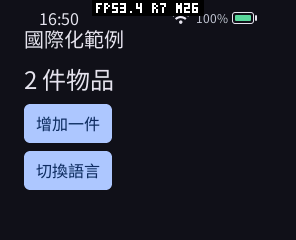
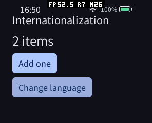
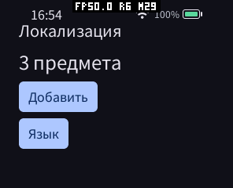

# 国际化 SDK 验证记录（2026-10-10）

本轮交付独立、可选的 C++ 国际化模块。支持静态目录、类型化与具名参数、复数/序数、
select、数字符号、语言回退、START/语言通知，以及固定容量和动态字符串两种输出。
此报告区分 SDK 本身、示例、Host 与设备整体占用，不作 C/C++ 语言性能比较。

## 实现与验证

| 改动 | 采用原因和收益 | 内存变化 | 验证 |
| --- | --- | --- | --- |
| 构建时生成 C++ 目录 | 设备无需解析 YAML，类型不匹配在编译时发现 | 仅应用选择的目录/规则；没有全局缓存 | 独立 SDK、三目标 Wasm/AOT、生成器确定性 |
| 静态视图与有界格式化 | HUD 可避免堆分配，超限不截断、不覆盖旧文本 | Translator 在 Wasm 为 72 B，TextBuffer<96> 为 100 B | 禁止 operator new 的格式化/UI 测试、ASan/UBSan |
| 动态字符串 | 语言和参数长度不确定时无需猜测缓冲区容量 | 只创建结果字符串，不预留大型缓冲区 | 32,775 B 结果恰好一次分配，capacity=32,775；超限在分配前拒绝 |
| CLDR 整数规则 | 正确区分复数、序数、尾零及 64 位边界 | 只嵌入实际使用的规则，重复规则去重 | CLDR 48 的 3,767 个普通样例、65 组规则通过 |
| 按消息回退与语言所有权 | 简繁选择可靠，事件销毁后语言仍有效 | Locale 为 65 B；不保存事件或复制目录 | 简繁/地区/扩展回退、缺失翻译、事件数据被覆盖后查找 |
| 可选 UI 绑定与 Host 通知 | 语言变化时只更新需要的文本，同长度更新也可见 | 不增加 Context 或所有应用的默认状态 | 固定/动态两种真实 AOT UI、四语言、按钮、前后台与三次重启 |

完整 SDK 原生回归在独立源码目录通过，包含固定和动态 UI 模式；生成器四项测试通过。
测试覆盖错误参数类型/个数、符号宽度、UINT64_MAX、INT64_MIN、无效 UTF-8、嵌入 NUL、
输出别名、容量不足、无终止字符数组、损坏/截断程序、错误事件 token 和重复记录。
另验证旧 C 目录生成、Arcade/Weather 导入和包清单回归。

CLDR 紧凑/指数形式及超出本模块数值域的 96 个样例没有执行，不把它们算作通过。
数据、来源 SHA-256 和 Unicode 许可证位于 `tools/i18n/cldr`。
规则来源为 [Unicode CLDR release-48](https://github.com/unicode-org/cldr/tree/release-48)，
其复数语义见 [Unicode 数字规范](https://unicode.org/reports/tr35/tr35-numbers.html#Language_Plural_Rules)。

## 默认开销与构建产物

在相同 WASI SDK 34、C++26、O3 和 AOT 编译器下，未使用国际化的 Counter 示例在修改前后
生成完全相同的 Wasm 和 x86_64 AOT 字节。这是未增加默认代码和线性内存声明的直接证据。

| 产物 | 修改前/后字节数 | 两次相同的 SHA-256 |
| --- | ---: | --- |
| Counter Wasm | 56,169 | `67293f4ecb61bf17f355492b51598470f219f55b7f3d2ea256c954d19006ae7c` |
| Counter x86_64 AOT | 90,772 | `a89d6a8c2f0f475d6ba57405d0ee8270e9d39462556b4cd38cf9752f0863c09b` |

固定容量国际化示例的 Wasm 为 81,319 B，x86_64 / ESP32-S3 / ESP32-S31 AOT 分别为
120,420 / 189,664 / 238,592 B。这些是文件大小，不等同于运行时 SRAM 或 PSRAM。
Wasm 初始内存声明为 2 页（128 KiB），最大 16 页（1 MiB），清单设置 pinned。
本轮没有单独取得设备上的 Guest 实际驻留、代码映射和 SDK 栈峰值，不用声明上限替代实测。
该示例不使用 GameRender，设备 Surface 帧、scratch、mailbox、probe 统计均为 0。
桌面 Host 新增启动方向记录与局部编码临时变量，没有新增常驻语言缓存；未测其栈峰值。

独立导出的 SDK 在源码仓库外成功编译、签名、打包 ESP32-S3 示例，没有 Guest C SDK 目录。
桌面隔离构建的 smoke、自检和国际化 CTest 均通过；真实 WAMR/LVGL 测试直接检查实际标签，
不是仅检查提交的字节。动态字符串版本也完成相同的 AOT 检查。

## 真机

主调试设备 A4:CB:8F:D5:D4:F0 的端口被另一个验收任务占用，未中断其应用。
使用空闲的 ESP32-S3 A4:CB:8F:D6:8D:A4（本次为 `/dev/ttyACM1`，固件 `c3917a1-dirty`）
完成真实显示检查。设备保留原有四个应用及数据，没有更新固件或修改语言、DPI、显示设置。
本轮安装的 `pxa-cpp-i18n` 已停止并清理；主设备的临时包也已清理，原验收应用保持运行。

设备截图确认中文简繁、英文、俄文、连续计数更新及再次启动可用。界面使用 dp 留边，
修正了早期示例标题与系统栏重叠的问题。截图中的 FPS 调试覆盖是原设备设置，
不能作为国际化吞吐或显示帧率基准。字体覆盖、黑体及字形仍由 Host 字体资源决定。

`INPUT SYNC` 只保证输入路由完成。拍摄前须给 Guest/UI 刷新时间；否则可能拍到上一状态、
按下态或锁屏。实际步骤为：先解锁、启动、等待稳定，再逐次点击，间隔等待后截图。
不能把工具等待时间当成应用输入延迟。

最终 24 dp 示例完成三次重启和三次独立 `MEMORY START/STOP` 局部测量。
安装过程和截图都排除在监测窗口之外。启动稳定后先切换四种语言预热，再测四次语言切换与
一次计数更新。输入之间等待 600 ms，让 Guest 和 UI 完成处理；不把等待时间作为延迟结论。

| 轮次 | 启动 SRAM 额外峰值 | 启动 PSRAM 额外峰值 | 预热后更新 SRAM 额外峰值 | 预热后更新 PSRAM 额外峰值 |
| --- | ---: | ---: | ---: | ---: |
| 1 | 5,456 B | 671,564 B | 4,100 B | 4,180 B |
| 2 | 4,664 B | 661,628 B | 164 B | 3,836 B |
| 3 | 4,664 B | 661,408 B | 164 B | 3,844 B |

额外峰值为对应窗口开始时的 free 减去该窗口的局部最低 free，包括 Host、WAMR、UI 和系统
任务，不能当成 Translator 自身占用。首次预热后稳定 SRAM free=56,103 B，PSRAM
free=6,453,748 B；后两轮分别为 56,103 / 6,453,048 B 和 56,103 / 6,453,056 B。
第 2、3 轮退出后的 PSRAM free 均为 6,861,140 B，未见连续启动带来的持续积累。
这些是本轮观测，不保证所有语言、字体和工作负载都具有相同峰值。

局部最低值来自实际分配 minima，不是轮询估计；每次 `MEMORY STOP` 恢复 boot-wide 统计。
设备历史最低值及预算 `peak_*` 均未作为本轮峰值。首次初始化、预热后更新和退出分别记录。
原始数据见 [三轮设备记录](measurements/esp32s3.json)。动态长文本的设备堆峰值和完整分项
Guest 内存仍待验证；Native 长文本分配测试与真实 AOT 动态 UI 已通过。

## 复现与限制

SDK 使用和构建命令见 [说明](README.zh-CN.md) 与 [完整 API 文档](../../I18N.zh-CN.md)。
本机原始日志、签名包、截图及内存快照位于工作区 `local/cpp-i18n-20261010/`。
其中 `native-isolated-final.log`、`generator-final.log`、`sanitizers.log`、`package-isolated.log`、
`ctest-final.log`、`dynamic-host-final.log`、`standalone-release.log` 是对应检查记录。
`counter-before` / `counter-after` 可复查零默认开销对照，`release-*` 是三种目标产物。
内存最终源数据为 `device-final-measurement.json`，另有早期布局的实验快照，不能跨时段当作优化对照。

当前不承诺完整 ICU、日期/货币/时区、全量 IANA 别名、自动 BiDi/shaping 或自动 RTL 布局。
动态 `std::string` 使用标准分配器规则，默认无异常 Guest 不能把内存耗尽转换成 Result；
严格预算下使用 `format_limited` 或固定缓冲区。UI 的协议文本/事务大小限制独立于格式化接口。
没有测量国际化查找的微秒级吞吐，也没有把事件刷新的示例 FPS 宣称为性能收益。
